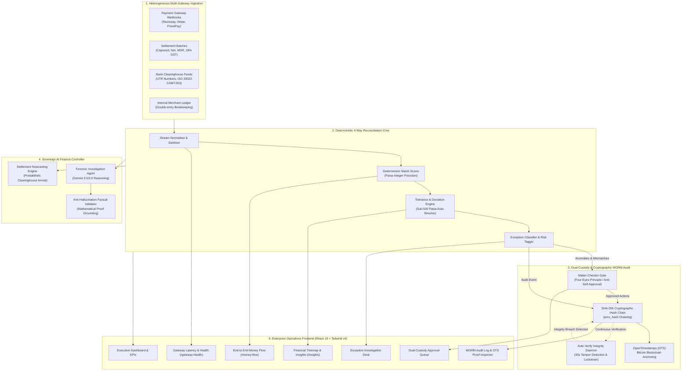

# LedgerLens Guard 🛡️
> **Autonomous 4-Way Financial Reconciliation Engine & Cryptographic WORM Audit Trail for Multi-Gateway Fintech Operations**

[](https://fastapi.tiangolo.com)
[](https://react.dev)
[](https://tailwindcss.com)
[](https://opentimestamps.org)
[](https://ledgerlens-guard-maxrest77s-projects.vercel.app)
[](#regulatory-compliance--data-protection)

---

## 🌐 Live Production Deployment
- **Production Web Application**: [https://ledgerlens-guard-maxrest77s-projects.vercel.app](https://ledgerlens-guard-maxrest77s-projects.vercel.app)
- **Deployment Preview**: [https://ledgerlens-guard-nirdlmsmx-maxrest77s-projects.vercel.app](https://ledgerlens-guard-nirdlmsmx-maxrest77s-projects.vercel.app)
- **Interactive API Swagger Docs**: `http://localhost:8000/docs`

---

## 🏛️ Executive Summary & Problem Statement

Modern fintech platforms, neo-banks, and merchant marketplaces process millions of transactions across fragmented payment gateways (Razorpay, Stripe, PrismPay, Cashfree), multiple acquiring banks, and complex commercial fee agreements.

In traditional financial operations:
1. **Floating-Point Rounding Leakage**: Standard IEEE-754 floating-point math causes micro-variances that compound into hundreds of thousands in unhedged ledger divergence.
2. **Hidden MDR Fee & GST Drift**: Undetected Merchant Discount Rate (MDR) fee tier shifts and 18% GST tax miscalculations go unnoticed for weeks, quietly draining margins.
3. **Single-Operator Fraud & Unauthorized Settlements**: Lack of dual-authorization gates allows single operators to arbitrarily write off high-value disputes or finalize unverified exceptions.
4. **Mutable Audit Logs**: Standard relational database audit logs can be retroactively altered or deleted by malicious actors or compromised database administrators without a mathematical trace.
5. **AI Hallucinations in Financial Reporting**: Off-the-shelf LLMs hallucinate figures, invent settlement dates, and cite phantom invoices when summarizing complex dispute histories.

**LedgerLens Guard** resolves these systemic vulnerabilities with an autonomous, deterministic 4-way reconciliation pipeline, an immutable Write-Once-Read-Many (WORM) audit ledger anchored to Bitcoin, a strict Maker-Checker dual-custody authorization gate, and a sovereign AI controller verified against ledger ground truth.

---

## 🏗️ System Architecture



---

## ⚡ Core Technological Innovations

### 1. Zero Floating-Point Drift: Integer-Paisa Arithmetic
All monetary representations are strictly parsed and calculated in **integer paisa** (`₹1.00 = 100 paisa`). 
- Completely eliminates IEEE-754 double-precision floating-point artifacts.
- Exact fee schedules (e.g. standard 2.0% + 18% GST vs. UPI 0.0% capped schemes) are derived mathematically with zero rounding leakage across multi-million transaction batches.

### 2. Maker-Checker Dual-Custody Failsafe (Four-Eyes Principle)
- **High-Severity & Critical Anomalies**: Automated hard stop preventing unilateral resolution.
- **Maker (`REVIEWER`)**: Investigates anomaly root causes, computes clawback eligibility, and proposes resolution actions with mandatory narrative rationales.
- **Checker (`ADMIN`)**: Reviews pending cases within the `/approval-queue` and authorizes or rejects proposals.
- **Anti-Self-Approval Constraint**: The system mathematically forbids any user from approving their own submitted resolution, mitigating insider fraud.

### 3. Cryptographic WORM Audit Trail & Bitcoin OTS Anchoring
- Every ledger mutation, rule modification, review decision, and status transition appends an immutable block to a SHA-256 cryptographic chain (`prev_hash` chaining).
- Periodic Merkle root commitments are timestamped into the **Bitcoin blockchain via OpenTimestamps (OTS)**.
- Any unauthorized SQL manipulation or retroactive row alteration invalidates the cryptographic hash chain.
- **Automated Integrity Lockdown Daemon**: Evaluates ledger chain integrity every 30 seconds. If a hash mismatch is discovered:
  - **Strike 1**: Immediately locks affected case IDs from further mutation.
  - **Strike 2**: Automatically engages full-system lockdown (HTTP 503 Emergency Maintenance circuit breaker), recording the incident in the audit ledger.

### 4. Sovereign AI Finance Controller & Anti-Hallucination Layer
- In-engine autonomous financial controller powered by Google Gemini reasoning.
- Generates contractual MDR dispute claims, settlement nowcasting, and forensic investigation briefs.
- **Hard Factual Validator**: Before returning answers, every single monetary figure, transaction reference, fee rate, and date is verified against the deterministic 4-way reconciliation ledger. If a figure cannot be mathematically grounded, it is redacted to prevent hallucinations.

### 5. Interactive Visual Operations Suite
- **Fintech Treemap (`/insights`)**: High-contrast, volume- and value-weighted interactive treemap visualizing anomaly code concentrations alongside a 90-day seasonal anomaly calendar.
- **Capital Money Flow (`/money-flow`)**: Complete capital path tracking from Gross Captured Volume through Gateway MDR Deductions, 18% GST Tax, and Chargeback reserves to Net Bank Credit.
- **Gateway Health (`/gateway-health`)**: Real-time telemetry monitoring webhook delivery latencies, authorization failure spikes, and expected settlement delays.
- **Tolerance Simulator (`/rules`)**: Dry-run tolerance adjustments and rule proposals against historical settlement batches before promoting to active enforcement.

---

## 🔒 Regulatory Compliance & Data Protection

| Standard / Regulation | Implementation in LedgerLens Guard |
| :--- | :--- |
| **RBI Data Localization** | Enforces regional data residency guards (`HOSTING_REGION = "ap-south-1"`). Disallows cross-border ledger replication. |
| **DPDP Act 2023** | Built-in Right to be Forgotten (`/scripts/dpdp_erasure.py`) cryptographically hashes PII while preserving double-entry ledger balance integrity. |
| **Statutory Audit Vault** | Time-limited, sealed cryptographic tokens (`/vault/access/:token`) allow external regulators (RBI, SEBI, SOX) to inspect immutable transaction packs. |
| **WORM Compliance** | Write-Once-Read-Many storage invariant backed by Bitcoin OpenTimestamps guarantees permanent non-repudiation. |

---

## 💻 Tech Stack & Infrastructure

- **Backend**: Python 3.11+, FastAPI, SQLModel / SQLAlchemy, SQLite (Dev) / PostgreSQL (Prod), OpenTimestamps, Uvicorn, Cryptography (Fernet/AES-256).
- **Frontend**: React 19, TypeScript, Vite 8, Tailwind CSS v4, Lucide Icons, Recharts, Radix UI primitives, Sonner notifications, Zustand.
- **Security & Headers**: Content-Security-Policy (CSP), Strict-Transport-Security (HSTS), X-Frame-Options (`DENY`), X-Content-Type-Options (`nosniff`), Referrer-Policy, Rate Limiting Middleware.
- **Hosting**: Vercel Edge Global CDN for frontend; containerized FastAPI service for backend.

---

## 🚀 Quickstart & Local Setup

### Prerequisites
- Python 3.11+ (recommended: [`uv`](https://github.com/astral-sh/uv) package manager)
- Node.js 20+ and `npm` / `pnpm`

### 1. Clone Repository
```bash
git clone https://github.com/maxrest77/LedgerLens-Guard.git
cd LedgerLens-Guard
```

### 2. Backend Setup
```bash
# Install dependencies and launch FastAPI server
uv run --directory backend uvicorn backend.api.main:app --host 127.0.0.1 --port 8000 --reload
```
- API Endpoint: `http://127.0.0.1:8000`
- Interactive Swagger UI: `http://127.0.0.1:8000/docs`
- Seeded test database initializes automatically on startup.

### 3. Frontend Setup
```bash
cd frontend
npm install
npm run dev
```
- Frontend UI: `http://localhost:5173`

---

## 👥 Seeded Demo Credentials

| Persona / Role | Email | Password | Access Rights |
| :--- | :--- | :--- | :--- |
| **Admin / Financial Controller** | `admin@ledgerlens.dev` | `demo_admin_2024` | Approval Queue, Command Center, Rule Simulator, Compliance, Vault Sharing |
| **Reviewer / Maker** | `reviewer@ledgerlens.dev` | `demo_reviewer_2024` | Executive Dashboard, Exception Investigation, AI Copilot, Audit Log |

---

## 🧪 Comprehensive Verification Suite

LedgerLens Guard includes an exhaustive automated test suite covering concurrency, WORM hash chain immutability, IDOR security, rate limiting, and fee versioning:

```bash
# Run backend pytest suite (50+ unit and integration tests)
uv run --directory backend pytest -v

# Run Bitcoin OTS anchor verification
uv run --directory backend python -m backend.scripts.verify_anchor

# Test frontend production build
cd frontend
npm run build
```

---

## 👤 Author & Attribution

**Designed, Architected, and Engineered by:**

### **Karthikeyan S**
*Autonomous Financial Systems & AI Systems Architect*

- **GitHub**: [@maxrest77](https://github.com/maxrest77)
- **Repository**: [https://github.com/maxrest77/LedgerLens-Guard](https://github.com/maxrest77/LedgerLens-Guard)
- **Production URL**: [https://ledgerlens-guard-maxrest77s-projects.vercel.app](https://ledgerlens-guard-maxrest77s-projects.vercel.app)

*Done by Karthikeyan S — 2026*
